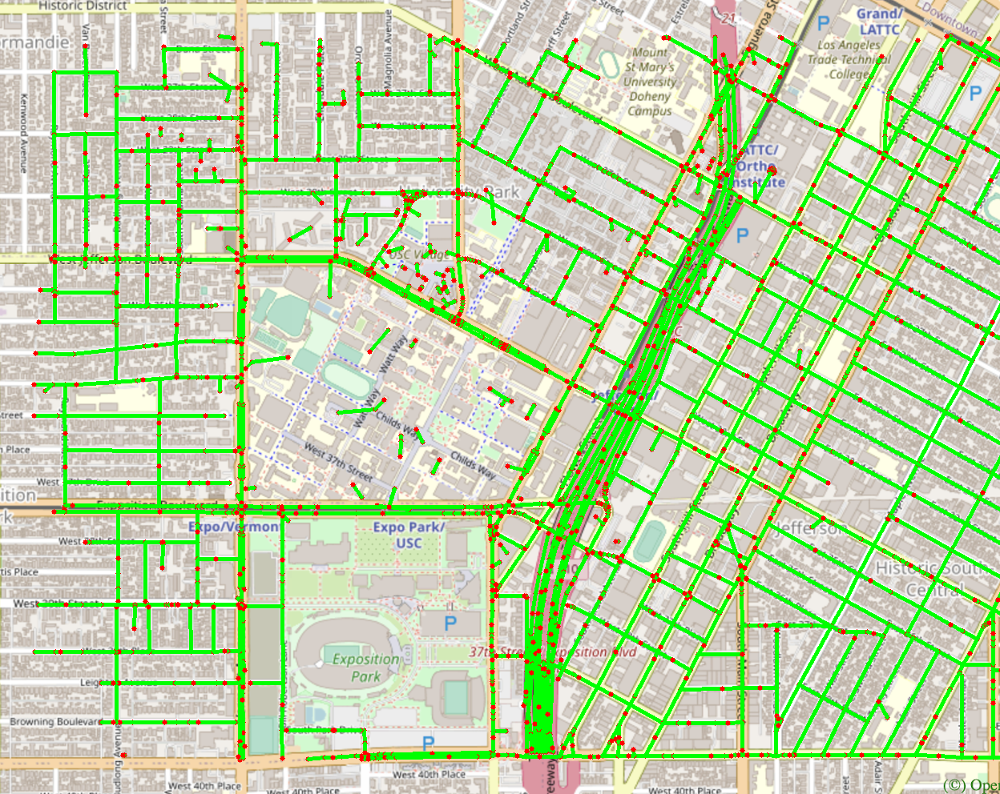
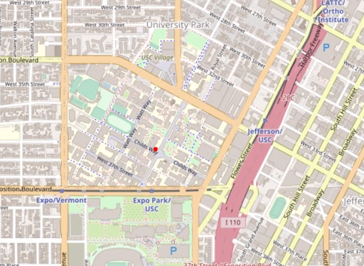
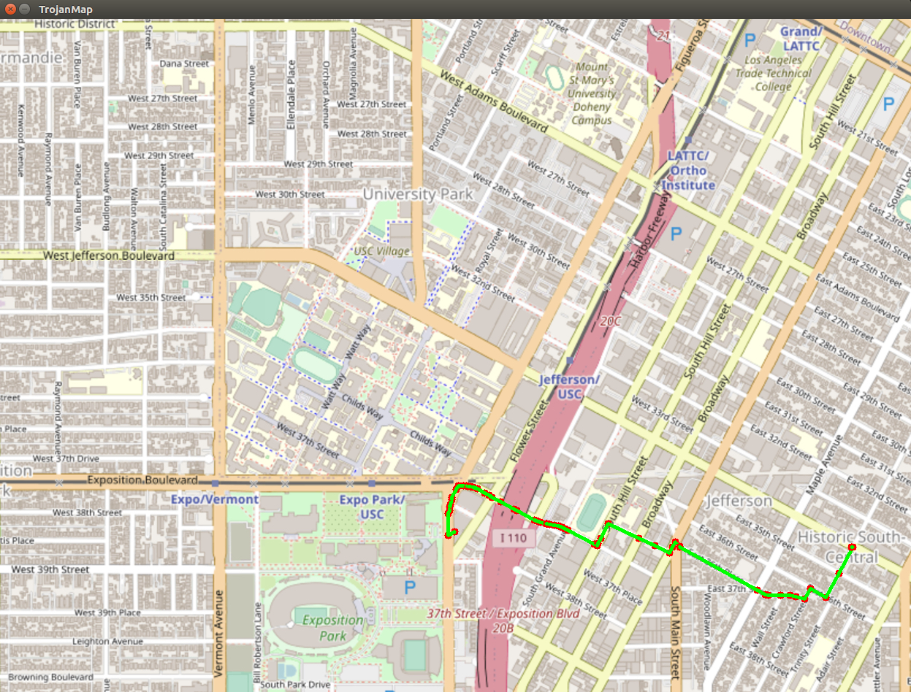
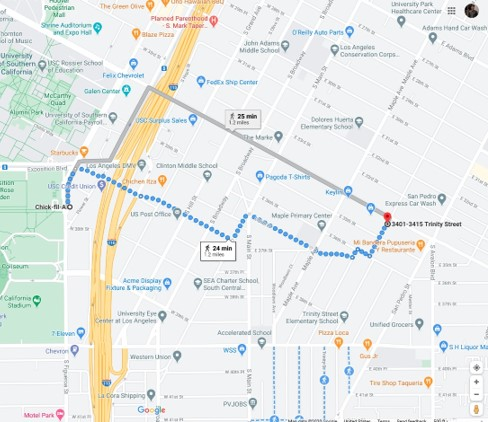
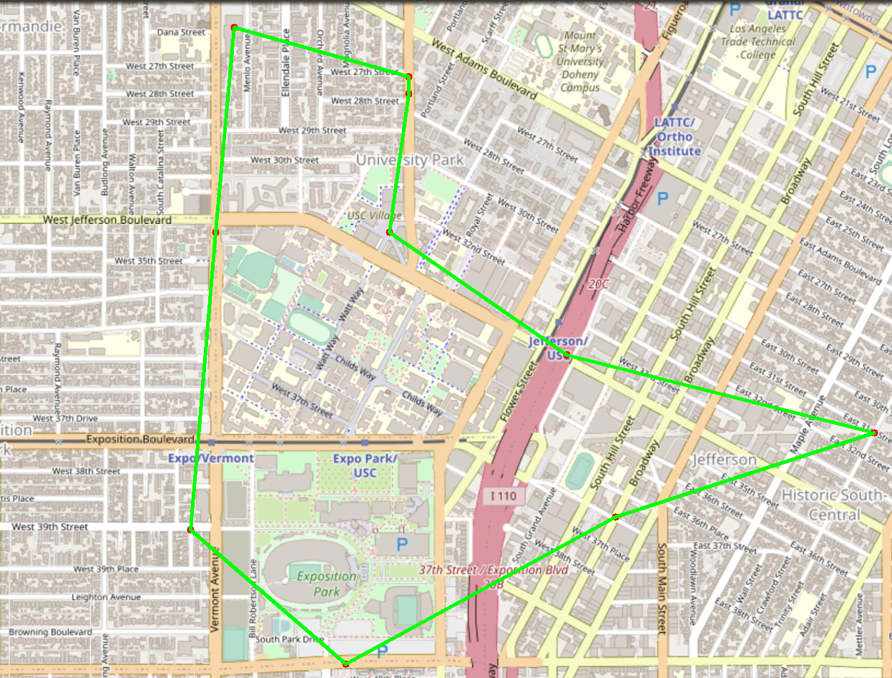
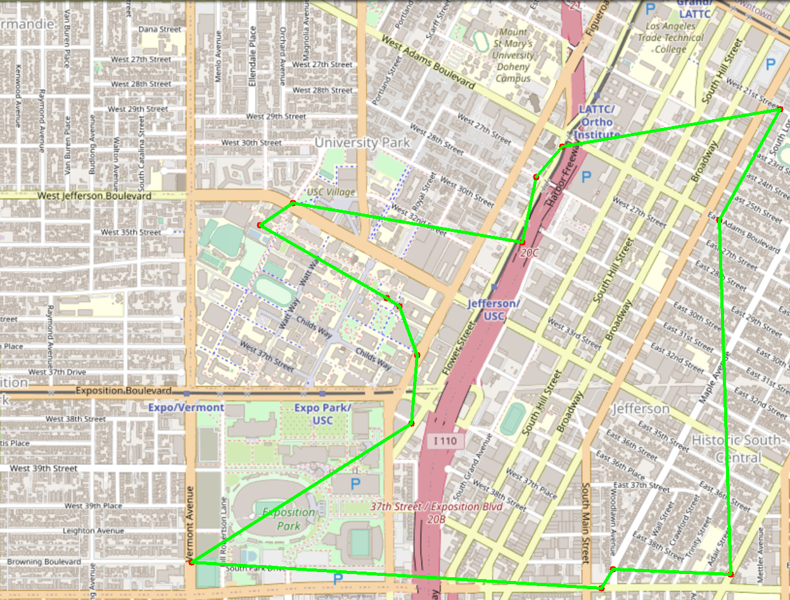
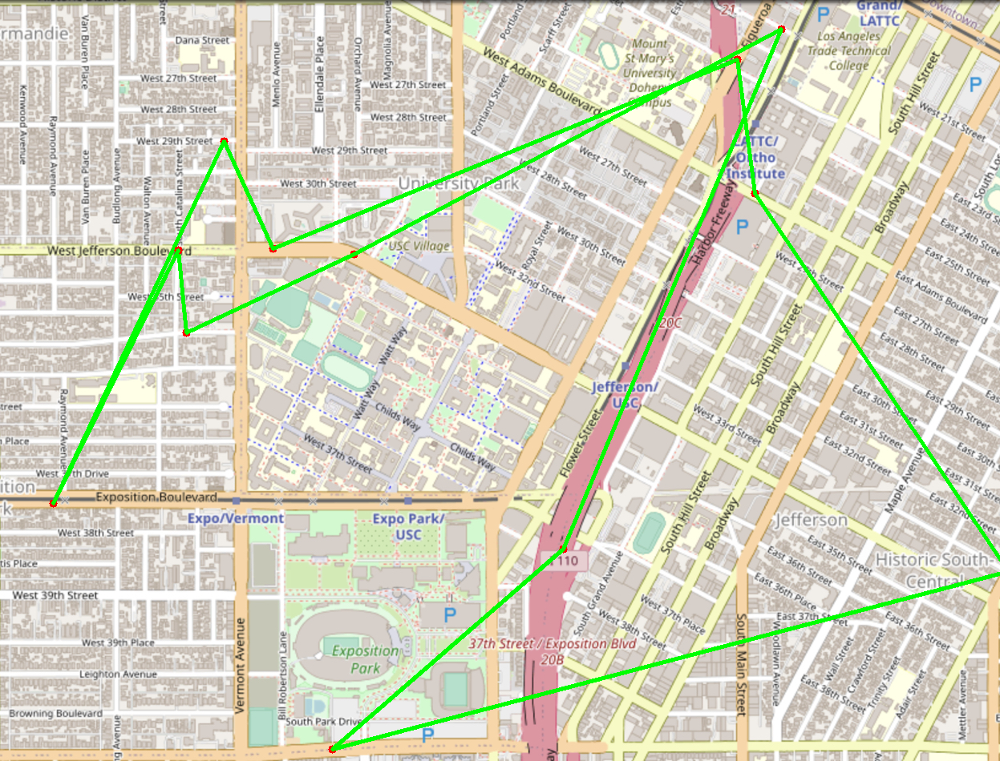

# EE599 Final Project - TrojanMap

# Team: Git Gud

## Members: Adithya Sanjeev Byalpi, Jatin Kumar Bollareddy

## Video: https://youtu.be/pd_5pxdFZfA

## TrojanMap

The task is to create a graph and perform mapping computations out of ~2000 coordinates located around the area of University of Southern California.

<p align="center"></p>

The features presented by the team are:
      - Autocomplete – Start
      - Autocomplete – End
      - Get Coordinates of a location based on name
      - Find the shortest path between 2 locations
      - Traveling salesman between N random locations
      - Traveling salesman – 2-opt
      - Traveling salesman – 3-opt

---

## The data Structure

Each point on the map is represented by the class **Node** shown below and defined in [trojanmap.h](src/lib/trojanmap.h).

```cpp
class Node {
  public:
    std::string id; // A unique id assign to each point
    double lat;     // Latitude
    double lon;     // Longitude
    std::string name; // Name of the location. E.g. "Bank of America".
    std::vector<std::string> neighbors; // List of the ids of all neighbor points.
};
```

## Features Implemented:

## Autocomplete - Start

```c++
std::vector<std::string> Autocomplete(std::string name);
```

Based on a partial name given by the user, the program can return a list of probable locations which start with the partial name.
The partial name given can be case-insensitive.
The time complexity of this function is **O(N)**.

Example:

Input: "ch" \
Output: ["ChickfilA", "Chipotle Mexican Grill"]

Input: "ta" \
Output: ["Target", "Tap Two Blue"]

```shell
1
**************************************************************
* 1. Autocomplete
**************************************************************

Please input a partial location:ch
*************************Results******************************
ChickfilA
Chipotle Mexican Grill
**************************************************************
```

## Autocomplete - Any

```c++
std::vector<std::string> Autocomplete_any(std::string name);
```

Based on a partial name given by the user, the program can return a list of probable locations which contain the partial name in the location. It does not matter where the partial name is found in the target.
The partial name given can be case-insensitive.
The time complexity of this function is **O(N)**.

Example:

Input: "to" \
Output: ["Tommy Trojan", "Menlo AvenueWest Twentyninth Street Historic District", 'Van Buren Place Historic District", "Hill 38 Washington",
"Department of Motor Vehicles", "Tutor Campus Center Piano", "Figueroa Optometry Center", "Cal Mart Beer 38 Wine Food Store",
"Vermont 38 Leighton Metro 204 Northbound05637", "Vermont 38 Leighton Metro 204 Southbound14018", "Moreton Fig", "Anna39s Store", "Historic SouthCentral",
"Astor Motel"]

```shell
2
**************************************************************
* 2. Autocomplete - Any                                       
**************************************************************

Please input a partial location:to
*************************Results******************************
Tommy Trojan
Menlo AvenueWest Twentyninth Street Historic District
Van Buren Place Historic District
Hill 38 Washington
Department of Motor Vehicles
Tutor Campus Center Piano
Figueroa Optometry Center
Cal Mart Beer 38 Wine Food Store
Vermont 38 Leighton Metro 204 Northbound05637
Vermont 38 Leighton Metro 204 Southbound14018
Moreton Fig
Anna39s Store
Historic SouthCentral
Astor Motel
**************************************************************
```

## Find the position

```c++
std::pair<double, double> GetPosition(std::string name);
```

Based on the name given by the user, the coordinates of the location is fetched and is graphically overlaid using OpenCV.
The program is case-sensitive and the time complexity is **O(N)**.

Example:

Input: "ChickfilA" \
Output: (34.0167334, -118.2825307)

Input: "Ralphs" \
Output: (34.0317653, -118.2908339)

Input: "Target" \
Output: (34.0257016, -118.2843512)

```shell
3
**************************************************************
* 3. Find the position                                        
**************************************************************

Please input a location:Tommy Trojan
*************************Results******************************
Latitude: 34.0206 Longitude: -118.285
**************************************************************
```

<p align="center"></p>

## Step 3: CalculateShortestPath

```c++
std::vector<std::string> CalculateShortestPath(std::string location1_name, std::string location2_name);
```

Given 2 locations by the user, the program calculates the shortest path between the start and destination. It prints out the waypoints on the screen and highlights the path on the graphical overlay.

Algorithm used: Dijkstra's Algorithm. Time complexity: **O(V^2)**, where V = number of vertices.
We implemented basic Dijkstra'S algorithm to find the shortest distance between any two nodes. We extended it to find the shortest path by storing the nearest parent of each node. Then we simply traversed through all the parents nodes to printout the shortest path.


Example:

Input: "ChickfilA", "Historic SouthCentral" \
Output: [4547476733","6820935911","1837212101","1837212103","6813411589","216155217","6813411590","1472141024","6813405280","348121864","6813405282","348122195","4399914021","348122196","348122197","348122198","4015405538","6820972454","269633045","269633572","1377766078","5541778221","6820972473","269633046","269633015","269633016","7249047931","269633017","269633018","269633019","6820972484","269633021","6820972480","6820982899","21302782","6820982898","4012792178","1732243772","1732243631","6807583648","122619498","4343588868","1716288017","4343588869","441893332","123015386","250768851","1758031815","123153849","250768852","1758031816","123732661","123380341","123380343","123009684","67666164","7360424710"]


```shell
4      
**************************************************************
* 4. CalculateShortestPath                                                  
**************************************************************

Please input the start location:ChickfilA
Please input the destination:Historic SouthCentral
*************************Results******************************
4547476733
6820935911
1837212101
1837212103
....
123380343
123009684
67666164
7360424710
**************************************************************
```

<p align="center"></p>

<p align="center"></p>

## Traveling Salesman - Brute force

```c++
std::pair<double, std::vector<std::vector<std::string>>> TravellingTrojan(std::vector<std::string> &location_ids);
```

Similar to the traveling salesman problem, based on the N number of locations given by the user, N random locations are selected and the shortest path to cover all these locations and return to the start of the loop.   

Algorithm - Brute Force
Time Complexity - **O(N!)**

<p align="center"></p>

```shell
5   
**************************************************************
* 5. Travelling salesman problem                              
**************************************************************

In this task, we will select N random points on the map and you need to find the path to travel these points and back to the start point.

Please input the number of the places:10
Calculating ...
7.80432
*************************Results******************************
123076790
269635105
5237417648
6807937306
6804883323
2578244375
4015203132
6815190433
1630944609
6820982916
123076790
**************************************************************
The distance of the path is:7.80432
**************************************************************
You could find your animation at src/lib/output.avi.          

**************************************************************
```

## Traveling Salesman - 2-Opt

```c++
std::pair<double, std::vector<std::vector<std::string>>> TravellingTrojan_2opt(std::vector<std::string> &location_ids);
```

Similar to the traveling salesman problem, based on the N number of locations given by the user, N random locations are selected and the shortest path to cover all these locations and return to the start of the loop.

Algorithm - 2-Opt
Time Complexity - **O(N^2)**

<p align="center"></p>

```shell
6
**************************************************************
* 6. Travelling salesman problem using 2-opt                              
**************************************************************

In this task, we will select N random points on the map and you need to find the path to travel these points and back to the start point.

Please input the number of the places:15
Calculating ...
*************************Results******************************
6807536682
269633703
6813379474
6042952605
6042978413
5231970323
1732243620
63765376
123152321
4019292085
122901104
7071968736
6805603634
2611833617
2193435045
6807536682
**************************************************************
The distance of the path is:8.85704
**************************************************************
You could find your animation at src/lib/output.avi.          

**************************************************************
```

## Traveling Salesman - 3-Opt

```c++
std::pair<double, std::vector<std::vector<std::string>>> TravellingTrojan_3opt(std::vector<std::string> &location_ids);
```

Similar to the traveling salesman problem, based on the N number of locations given by the user, N random locations are selected and the shortest path to cover all these locations and return to the start of the loop.

Algorithm - 3-Opt
Time Complexity - **O(N^3)**

<p align="center"></p>

```shell
7
**************************************************************
* 7. Travelling salesman problem using 3-opt                              
**************************************************************

In this task, we will select N random points on the map and you need to find the path to travel these points and back to the start point.

Please input the number of the places:12
Calculating ...
*************************Results******************************
6816193787
1473199425
21306059
7130092332
5768963636
1862312572
1790748073
5680945528
1832234141
6455522215
2613117876
4015405545
6816193787
**************************************************************
The distance of the path is:13.5588
**************************************************************
```

## Traveling Salesman Implementations and Comparisons

Implementations:
      - Brute Force
      - 2-Opt
      - 3-Opt

Brute Force: As the name suggests, this algorithm considers all the possible permutations of the path and chooses the one with the least distance. We generate all the possible perputaions of the path with the source and destination beign constanst(and also same) and then compute the shortest path among them. Both generation of the path and calculating its distance happens simultaneously. This is guaranteed to give an optimal path as it considers all possible routes. However, as the number of nodes increase, the number of possible paths increase exponentially, making this a very bad algorithm in terms of timing.

2-Opt: This is a heuristic algorithm which assumes that there is a cross/overlap in the path of the initial loop. In order to straighten it, 2 edges are chosen and rearranged to check for improvement. This is repeated till there are no more improvements possible.

3-Opt: Another heuristic algorithm, this is built up upon 2-opt. It is possible that there exists a sequence of 2-opt moves that improves the tour and it begins with 2-opt move that increases the length of the tour. But because of this “bad” move when we use 2-optimization only, this sequence of moves will not be executed. So, 3 edges are removed and rearranged to check for improvement. This is repeated till there are no more improvements possible.

Both 2-opt and 3-opt are heuristic algorithms, not guaranteed to come with the optimum solution all the time. However there do offer a significant time improvement over the brute force algorithm with some sacrifice in accuracy.

## Comparisons of all the TSP implementations

For the time, we can see the differences for the three algorithms. Here, the time is in seconds.

*********************************************************
| Points        |    9    |  10  |   11  |   12  |  13  |
*********************************************************
| Bruteforce    |   0.73  | 6.87 | 79.29 | 956   | -    |
| 2-opt         |   0.013 | 0.02 | 0.032 | 0.037 | 0.05 |
| 3-opt         |   0.026 | 0.03 | 0.049 | 0.063 | 0.08 |
*********************************************************

## Conclusions and Lessons Learnt

We were able to learn how to apply various prominent graph manipulation algorithms to a graph which is represented in a different method.

We were able to realize the complexities involved with resect to time if we implement a brute force algorithm for a graph with lot of nodes, which could be clearly seen with the traveling trojan problem.

We plan to implement another shortest path algorithm for the project and compare the results.

We were able to understand the logic behind a heuristic approach and the intricacies involved with why it will not always find the most optimized path.
